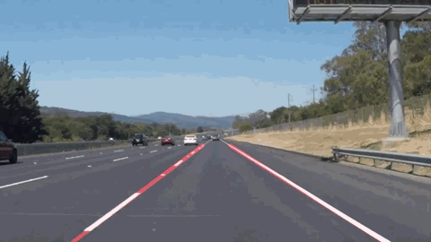

This is my solution for Finding Lane Lines project of the great [Udacity Self-Driving Car Engineer Nanodegree](https://www.udacity.com/course/self-driving-car-engineer-nanodegree--nd013).

# Goal
Detect lane lines in images and videos using Python and OpenCV. 



See the source media files in [test_images](P01_BasicLaneFinding/test_images) and [test_videos](P01_BasicLaneFinding/test_videos) folder.

---
# Solution
See the generated images and videos in [test_images_output](P01_BasicLaneFinding/test_images_output) and [test_videos_output](P01_BasicLaneFinding/test_videos_output) folder.

Dependencies: python3, open-cv, numpy, matplotlib, moviepy.<BR>
To run the script type in the command line:<BR>
    ```
    python3 P01.py
    ```
<BR><BR>
For detailed description see the [writeup.md](P01_BasicLaneFinding/writeup.md).

